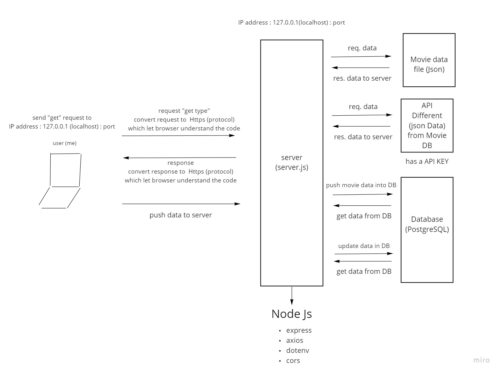

# Movies-Library - "1.0.0"

**Author Name**: Faisal Al-hawajreh

## WRRC

## Overview

## Getting Started
1. create your server file as Javascript file.
2. collect the data you need and put it in json file to use it(it will be your database).
3. install node in your local device and use its packages, node : use protocol that browser used.
4. (Request) open your browser and type IP of your device (localhost:port => 127.0.0.1:(Port : you can choose the number you want when you create your server file such as 3000,5000,etc.)
5. (Response) browser will display the results depending on your server code. 

<!-- What are the steps that a user must take in order to build this app on their own machine and get it running? -->

## Project Features
<!-- What are the features included in you app -->
1. In the home page (localHost:PORT\ ): we get the movie data from movies data file (json) which is our database, to be displayed.

2. In the favorite page (localHost:PORT/favorite): it will display greeting sentance to user.

3. (localHost:PORT/... ) If we write wrong address in our localhost, it will display an error for us.

4. In the trending page (localHost:PORT/trending): it will show you the details of spider man movie. (you can see other movie detail by changing id number).

5. In the search page (localHost:PORT/search):enter the movie name (query params) and it will show you all the details about it. if you want to search for Boruto: Naruto the Movie; write  (.../search?movieName=Boruto: Naruto the Movie)

6. In the languages page (localHost:PORT/languages): it will show you the language Abbreviation according to iso.

7. In the jobs page(localHost:PORT/jobs): enter the department name(query params) and it will show you the jobs inside this department. (to get in Actors  department write  (.../jobs?departmentName=Actors))

8. If something wrong happen in API website and server doesn't reach to data , it will show you an error message (status: 500 (Internal Server Error)).

9. (localHost:PORT/addMovie) now you can add your favorite movie and give us your opinion by getting in to (add movie page), your opinion is interesting for us, so we will save your movie in our database.

10. (localHost:PORT/getMovies) to see all movies that you commented on it, you can get in to (get movies page) to get all comments on all movies.

11. when you see :id that mean (choose the movie by type their id in address) such as (.../updateMovie/2).

12. (localHost:PORT/updateMovie/:id): here you can edit your movie name or your comment which is saved in the database by entering the new information as JSON code in the body.

13. (localHost:PORT/deleteMovie/:id): this endpoint used to delete movie from DB by type id as shown in step 11.
14. (localHost:PORT/getOneMovie/:id): in this page , it will show you the information of movie that you type its id in the address (step 11).