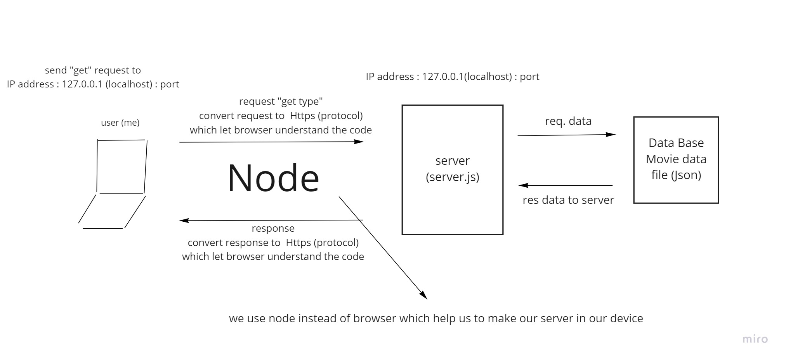

# Movies-Library - "1.0.0"

**Author Name**: Faisal Al-hawajreh

## WRRC

## Overview

## Getting Started
1. create your server file as Javascript file.
2. collect the data you need and put it in json file to use it(it will be your database).
3. install node in your local device and use its packages, node : use protocol that browser used.
4. (Request) open your browser and type IP of your device (localhost:port => 127.0.0.1:(Port : you can choose the number you want when you create your server file such as 3000,5000,etc.)
5. (Response) browser will display the results depending on your server code. 

<!-- What are the steps that a user must take in order to build this app on their own machine and get it running? -->

## Project Features
<!-- What are the features included in you app -->
1. In home page : we get the movie data from movies data file (json) which is our database, to be displayed.
2. In favorite page : it will display greeting sentance to user.
3. If we write wrong address in our localhost, it will display an error for us.